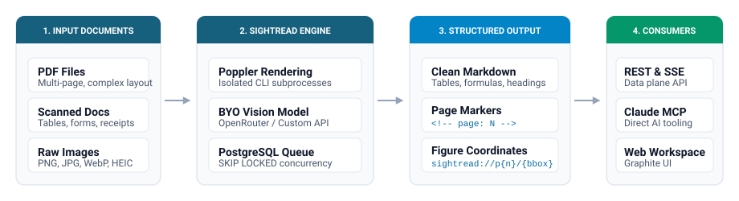

# Sightread

<p align="center">
  <strong>Vision document parsing service: turn complex PDFs and images into structured Markdown with precise figure coordinates.</strong>
</p>

<p align="center">
  <a href="./README.md">English</a> · <a href="./README.zh-TW.md">繁體中文</a>
</p>

<p align="center">
  
  
  
  
  
  
</p>

---

**Sightread** is a self-hosted, multi-user document parsing service designed for developers and AI agents. It transforms unstructured PDFs, scans, and images into clean, layout-preserving Markdown, extracting exact bounding box coordinates for figures and charts.

Bring your own OpenRouter key or connect custom OpenAI-compatible vision endpoints. Every vision call bills directly to your provider account with zero markup.

---

## Key Features

- **Vision-First Precision** — Accurately extracts multi-column text, dense tables, mathematical formulas, and diagrams that break traditional OCR engines.
- **Normalized Figure Coordinates** — Returns visual figure boundaries as normalized `[ymin, xmin, ymax, xmax]` coordinates (`sightread://p{page}/{coords}`) for precise downstream cropping in RAG pipelines.
- **Zero Markup / BYO Keys** — Connect your personal OpenRouter key or custom OpenAI-compatible vision endpoints. No middleman subscription fees or token markups.
- **Built for AI Agents & MCP** — Native Model Context Protocol (MCP) server with OAuth 2.1 support for Claude Desktop, Claude Code, and autonomous agents.
- **Modern Web Workspace** — Graphite-themed UI featuring nested folders, drag-and-drop uploads, live SSE progress streaming, and instant side-by-side previews.
- **Privacy by Default** — Uploaded source documents are processed in isolated subprocesses and purged from disk immediately once parsing completes.

---

## How It Works

<p align="center">
  
</p>

1. **Upload** a PDF, scan, or image via the Web UI, REST API, or Claude MCP tool.
2. **Process** pages in parallel using isolated Poppler subprocesses and your configured vision model.
3. **Receive** clean Markdown with embedded page markers (`<!-- page: N -->`) and figure coordinates.
4. **Integrate** seamlessly into downstream RAG indexing, document search, or agent context.

---

## Quick Start

### 1. Launch with Docker Compose

```bash
cp .env.example .env
docker compose up --build
```

| Service | URL | Notes |
|---|---|---|
| **Web Workspace** | `http://localhost:3000` | Full file library, settings, and result viewer |
| **REST API** | `http://localhost:8000` | Data plane (`/v1/*`) and MCP endpoint (`/mcp`) |

> Set `AUTH_DEV_MODE=true` in `.env` to sign in locally without Google OAuth credentials.

---

## Integrations

### REST API

```bash
curl -X POST http://localhost:8000/v1/parse \
  -H "Authorization: Bearer <YOUR_API_KEY>" \
  -F "file=@financial-report.pdf" \
  -F "model=google/gemini-2.5-flash"
```

### Claude Desktop / MCP Configuration

Add Sightread to your `claude_desktop_config.json`:

```json
{
  "mcpServers": {
    "sightread": {
      "command": "npx",
      "args": [
        "-y",
        "mcp-remote",
        "http://localhost:8000/mcp",
        "--header",
        "Authorization: Bearer <YOUR_API_KEY>"
      ]
    }
  }
}
```

Or connect it directly in Claude via the OAuth Custom Connector endpoint: `https://<your-domain>/mcp`.

---

## Architecture & Stack

| Layer | Technology | Purpose |
|---|---|---|
| **API & Data Plane** | FastAPI (Python 3.12, `uv`) | High-performance REST endpoints and SSE streaming |
| **Task Queue** | PostgreSQL (`SKIP LOCKED`) | Reliable transactional job queue without Redis |
| **PDF Rendering** | Poppler CLI (`pdftoppm`) | Crash-isolated subprocess rendering (MIT-safe) |
| **Web Interface** | Nuxt (Vue 3) + Tailwind CSS | Graphite design system, file workspace, i18n |
| **Edge & Proxy** | Caddy | Automatic TLS certificates and SSE reverse proxy |

---

## Documentation

- [Product Overview & Design Goals](./docs/product.md)
- [API Reference & Data Plane](./docs/api.md)
- [MCP Server & Claude Connectors](./docs/mcp.md)
- [Parsing Pipeline & Bounding Boxes](./docs/parsing.md)
- [Deployment & Self-Hosting Guide](./docs/deployment.md)
- [Full Documentation Map](./docs/index.md)

---

## License

[MIT](LICENSE)
